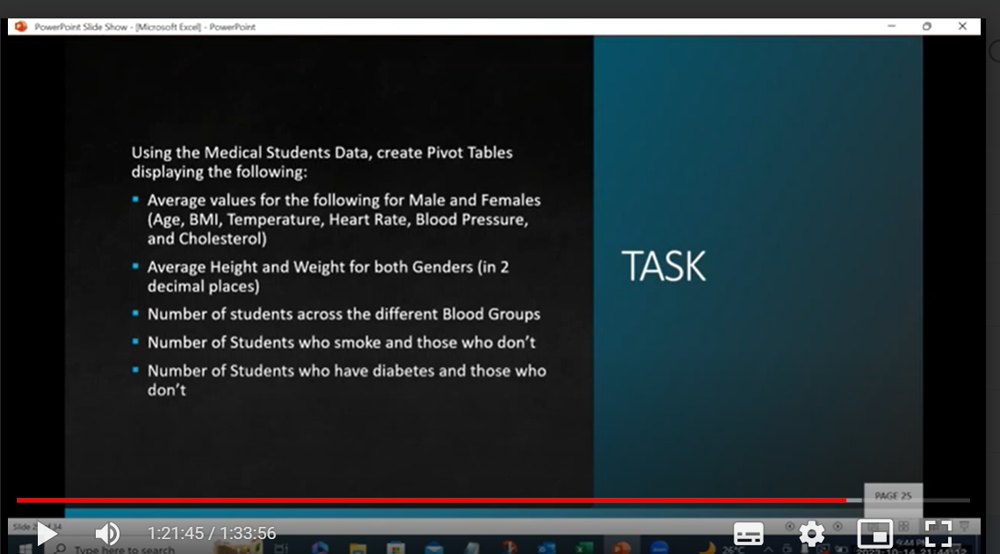
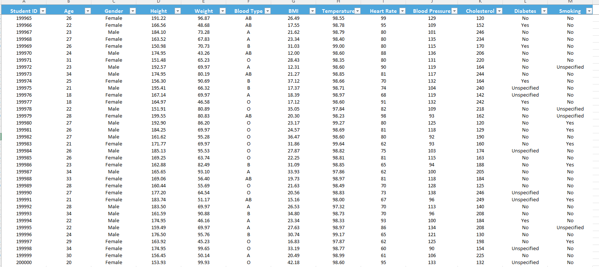
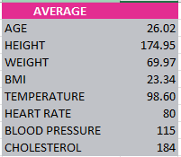

# Medical-Data-Analysis
Data Analysis using Excel to answer data questions and create insightful visualizations.

## **Introduction**

This is an Excel project on the analysis of medical students' data. This project aims to use pivot tables and pivot charts to show trends in a medical student data and provide useful insights on the data to stakeholders.

-Disclaimer: The dataset used for this project are made up for the purpose of demonstrating Excel skills. They do not represent any institution, company, or organization.

## **Skills Demonstrated**

- Pivot Table
- Pivot Charts
- find and replace
- sort and filter
- data type formatting
- functions

## **Questions to be answered**
The following representations were required:

### _Step 1_: 
The medical student dataset was cleaned and filtered. There were missing data in several rows. The "find and replace" functionality was used to find the averages of numerical values and these were used to fill in the blanks. Also, for columns with text data, specific instructions were given on what to replace the blanks with and this was effecctively done.

Data Set                    |              Average Values
:-------------------------:|:--------------------------------:
                
