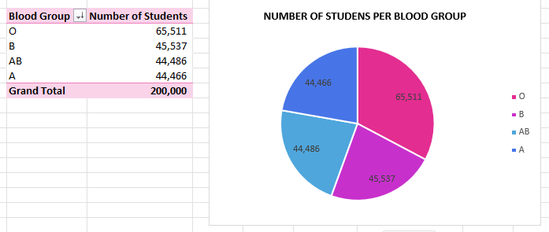
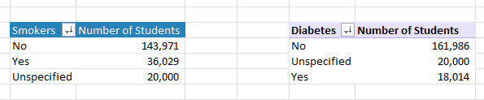
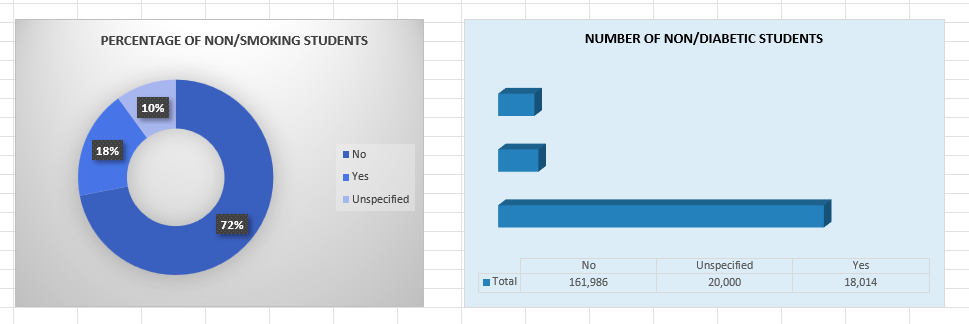

# Medical-Data-Analysis
Data Analysis using Excel to answer data questions and create insightful visualizations.

## **Introduction**

This is an Excel project on the analysis of medical students' data. This project aims to use pivot tables and pivot charts to show trends in a medical student data and provide useful insights on the data to stakeholders.

-Disclaimer: The dataset used for this project are made up for the purpose of demonstrating Excel skills. They do not represent any institution, company, or organization.

## **Skills Demonstrated**

- Pivot Table
- Pivot Charts
- find and replace
- sort and filter
- data type formatting
- functions

## **Questions to be answered**
The following representations were required:

## **Data Sourcing**

The dataset was provided by my insructor. The file was downloaded as CSV and formatted and cleaned in Excel. The dataset contained:
- One sheet with medical students' infomation which included student ID, age, gender, height, weight, blood type, BMI, temperature, heart rate, blood pressure, cholesterol level, diabetes, and smoking.
- Two hundred thousand (200,000) rows and 13 columns.

## **Data Transformation and cleaning**

### _Step 1_: 
The medical student dataset was cleaned, filtered, and efficiently transformed. There were missing data in several rows. The "find and replace" functionality was used to find the averages of numerical values and these were used to fill in the blanks. Also, for columns with text data, specific instructions were given on what to replace the blanks with and this was effecctively done.

Data Set 
:-------------------------:
 

Average Values 
:-------------------------:

### _Step 2_: 
Using the pivot table and charts functionalities, the the following insights and visualizations were created.

1. Comparing and visualizing the average vitals signs value for male and females. This visualization shows the differences in the age, BMI, temperature, heart rate, blood pressure, and cholesterol levels for male and female medical students.
   * Insights: The male in this dataset are older than the females on average. They have a slighly higher cholesterol level than females, slighly lovwe BMI, blood pressure, and heart rate. The temperature values remains constant accross both genders.

  

2. Comparing the average weight and height of male and female students. This demonstrates who between the males and females are taller on avaerage and who weighs more.
   * Insights: From the representation below, females appear to be taller than the males on average, and likewise, they weigh slightly more than the males on average.

Pivot Table 
:------------------------:
  

Pivot Chart
:-------------------------:

3. Displaying the number of students accross different blood groups. This visualization demonstrates the number of students who are in the blood group category A, B, AB and O.
   * Insights: Blood group O has the most number of students while blood group A has the least.

   

4. Comparing and visulaizing smokers and non-smokers along side diabetics and non-diabetics. This presented the data of smokers, non-smokers, diabetics and non-diabetics. There were some students who did not specify as such, we categorized the no response as 'unspecified".
   * Insights: Most studensts are non-smokers and non-diabetics.

  Pivot Table 
:------------------------:
   

   Pivot Chart 
:------------------------:

## **Conclusions and recommendations**

* On average, the is little or no significant difference between the vitals of male and female medical students as seen by the diffenet visualizations displayed above.
* It should be noted that we have more non-diabetic students than diabetics, however, the number of diabetics i.e. 18,014 is a significant number. This can be taken into consideration when developing cafeteria meal plans for the school. Food varieties that can accomodate people with diabetes should be considered.
* There is a significant number of smokers in the medical school. This is a very vital insight for the school. Medical campaigns, health weeks, webinars or seminars, can use this information to create health talks targeted at educating students on the dangers of smoking to overall health, and can advocate for safer options.
* Majority of the students fall under the O blood group meaning that there are more potential unviersal blood donors in this institution.

   ## THANK YOU.
